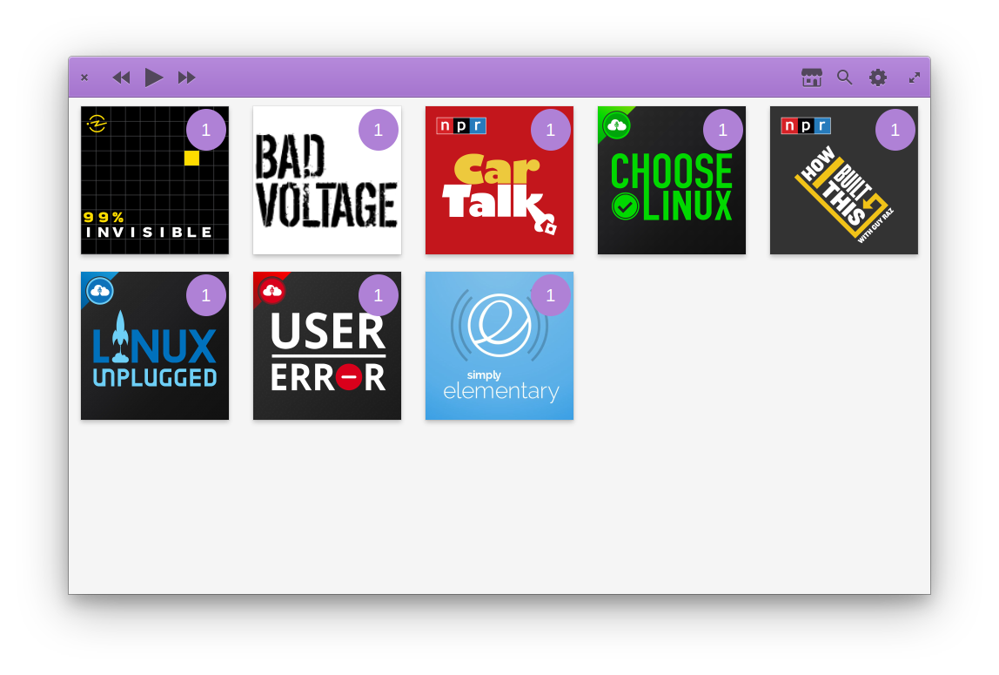

# Vocal

## The podcast client for the modern free desktop.

Vocal is a powerful, fast, and intuitive application that helps users find new podcasts, manage their libraries, and enjoy the best that indepedent audio and video publishing has to offer. Vocal features full support for both episode downloading and streaming, native system integration, iTunes store search and top 100 charts (with international results support), iTunes link parsing, OPML importing and exporting, and so much more. Plus, it has great smart features like automatically keeping your library clean from old files, and the ability to set custom skip intervals.

## Official Installation Options

### elementary OS AppCenter
Vocal is available on elementary OS via download directly from AppCenter 

### Flatpak
Vocal can be installed via Flatpak on most modern Linux systems via the following command:

    flatpak install --from https://flathub.org/repo/appstream/com.github.needleandthread.vocal.flatpakref

### Snap
An official snap package is not yet available, although some community members are working on it.

### Debian Installers
64-bit .deb installers can be downloaded from our [releases](https://github.com/needle-and-thread/vocal/releases) page. Please note: this method is highly discouraged. With the benefits of sandboxing, improved security, and greater simplicity, we are moving away from older installation methods. **Also, please note that our stable and daily PPAs will be abandoned in the near future.**

#### Building from source (on Debian based systems):

1. Clone source:
    git clone https://github.com/needle-and-thread/vocal.git

2. Install build dependencies:
    * libsecret-1-dev 
    * libclutter-gst-3.0-dev 
    * sqlite3
    * libwebkit2gtk-4.0-dev 
    * libgee-0.8-dev
    * gir1.2-granite-1.0
    * libgranite-dev
    * libgranite5

3. Make the build folder:
   cd vocal
   mkdir -p build
   cd build

4. Build the package:
   cmake ..
   make

5. Install the package:
   sudo make install

### Official OS packages
We're working with a number of distributions to make sure it's as simple as possible to get Vocal out-of-the-box. Check below for the list of distributions where Vocal can be downloaded from the official repositories.

* [Fedora](https://apps.fedoraproject.org/packages/vocal)
* [openSUSE](https://software.opensuse.org//download.html?project=multimedia%3Aapps&package=vocal)

## Get Involved

### Code
We love collaborating with others and gladly welcome code contributions. Pull requests are much appreciated. Please feel free to jump in and help with any confirmed issues (make sure you leave a comment or assign yourself so we know it's being worked on). If you have a new feature in mind that you would like to work on, we recommend opening an issue first and making sure the feature gets approved just so you don't spend your time implementing something that wouldn't get accepted into the project.

Vocal adheres to the [elementary code style](https://elementary.io/docs/code/reference). Please be sure to review it before writing code. If you have any questions, please ask.

The Vocal project is hosted on GitHub: https://github.com/needle-and-thread/vocal

### Bugs and Feature Requests  
Please report bugs and feature requests at https://github.com/needle-and-thread/vocal/issues

### Translations
To contribute translations please visit https://www.transifex.com/needle-and-thread/vocal/

## FAQs, Documentation, and Project Roadmaps
Please consult our [wiki](https://github.com/needle-and-thread/vocal/wiki) for documentation, frequently asked questions, and project roadmaps
